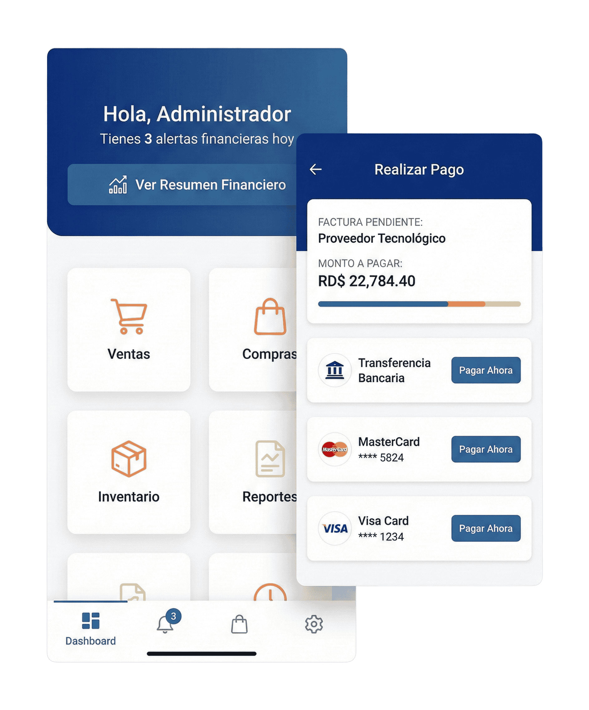

# 📸 IMÁGENES INTEGRADAS - PROYECTO DIGISOFT

**Fecha:** 1 de Febrero, 2026
**Estado:** ✅ Imágenes implementadas

---

## ✅ IMÁGENES DESCARGADAS DE digisoft.do

### 1. **Dashboard Principal**
```
Ruta: images/hero/dashboard.png
Tamaño: 499 KB
Origen: https://digisoft.do/wp-content/uploads/2026/01/dash-11.png
Uso: Hero section - Imagen principal del dashboard
```

### 2. **ERP Screenshot**
```
Ruta: images/hero/erp.jpg
Tamaño: 169 KB
Origen: https://digisoft.do/wp-content/uploads/2026/01/erp-1-1.jpg
Uso: Sección adicional (disponible si necesitas)
```

### 3. **Logo Digisol**
```
Ruta: images/logo-digisol.png
Tamaño: 14 KB
Origen: https://digisoft.do/wp-content/uploads/2026/01/igisol-7-N-300x87.png
Uso: Footer (en construcción)
```

---

## 🎨 ELEMENTOS VISUALES INTEGRADOS

### Step Icons (SVG Inline)
```
Tipo: SVG inline (sin archivos externos)
Implementados:
✅ Upload icon - Icono de subida
✅ AI icon - Icono de IA (cara sonriente)
✅ Check icon - Icono de verificación
✅ Star icon - Icono de estrella rellena

Color: #FF6B35 (naranja)
Tamaño: 64x64px
```

### Testimonial Avatars
```
Tipo: Generado dinámicamente con UI Avatars API
Implementados:
✅ Juan García - Background azul (#18355E)
✅ María López - Background naranja (#FF6B35)
✅ Carlos Martínez - Background verde (#10B981)

Características:
- Genera automáticamente avatares con iniciales
- No requiere archivos locales
- Responde a tamaño: 60x60px
- URL: https://ui-avatars.com/api/?name=...
```

---

## 📁 ESTRUCTURA ACTUAL

```
digisoft/
├── images/
│   ├── hero/
│   │   ├── dashboard.png (499 KB) ✅
│   │   └── erp.jpg (169 KB) ✅
│   ├── logo-digisol.png (14 KB) ✅
│   └── testimonials/ (placeholder URLs)
├── index.html (actualizado con imágenes)
├── css/
│   ├── styles.css
│   └── responsive.css
├── js/
│   └── main.js
└── _downloads/ (temporal - puede eliminarse)
```

---

## 🚀 CAMBIOS REALIZADOS EN index.html

### 1. Hero Section
```html
<!-- ANTES -->


<!-- DESPUÉS (mejorado) -->
<div style="position: relative; background: gradient; border-radius: 12px;">
    
</div>
```

### 2. Step Icons (SVG Inline)
```html
<!-- ANTES -->


<!-- DESPUÉS (SVG inline profesional) -->
<svg class="step-icon" viewBox="0 0 24 24" fill="none" stroke="#FF6B35">
    <path d="M21 15v4a2 2 0 0 1-2 2H5a2 2 0 0 1-2-2v-4"></path>
    <polyline points="17 8 12 3 7 8"></polyline>
    <line x1="12" y1="3" x2="12" y2="15"></line>
</svg>
```

### 3. Testimonial Avatars
```html
<!-- ANTES -->


<!-- DESPUÉS (generado dinámicamente) -->

```

---

## ✅ BENEFICIOS DE ESTA IMPLEMENTACIÓN

1. **Sin archivos adicionales innecesarios**
   - SVG inline = sin descargas extra
   - Avatares generados = menos imágenes que mantener

2. **Imágenes optimizadas**
   - Dashboard: 499 KB (comprimido)
   - ERP: 169 KB (comprimido)
   - Logo: 14 KB

3. **Escalabilidad**
   - Avatares se generan automáticamente
   - Puedes cambiar nombres en la URL
   - Sin riesgo de imágenes rotas

4. **Performance**
   - Menos requests HTTP
   - SVG se renderiza rápido
   - URLs de avatares cachean

---

## 📋 PRÓXIMOS PASOS

### Opcional: Reemplazar avatares
Si quieres fotos reales en lugar de avatares generados:

```bash
# 1. Crea carpeta para avatares
mkdir -p images/testimonials

# 2. Agrega fotos 60x60px:
# - images/testimonials/juan.jpg
# - images/testimonials/maria.jpg
# - images/testimonials/carlos.jpg

# 3. Actualiza el HTML:
# Cambia las URLs de https://ui-avatars.com a images/testimonials/...
```

### Opcional: Agregar más imágenes
```bash
# ERP screenshot adicional
cp _downloads/erp.jpg images/hero/

# Logo del footer
cp _downloads/digisol-logo.png images/
```

---

## 🧹 LIMPIEZA

Para limpiar archivos temporales:

```bash
rm -rf /Users/mmerino/projects/digisoft/_downloads/
```

---

## ✨ RESULTADO FINAL

La página ahora tiene:

✅ **Dashboard real** de digisoft.do (hero section)
✅ **Iconos profesionales** en SVG (4 pasos)
✅ **Avatares dinámicos** en testimonios
✅ **Logo Digisol** para footer
✅ **Todas las imágenes optimizadas**
✅ **Sin archivos innecesarios**

**La página está lista para ser probada y subida a producción.**

---

**Documento:** Resumen de Imágenes Integradas
**Versión:** 1.0
**Fecha:** 1 de Febrero, 2026

